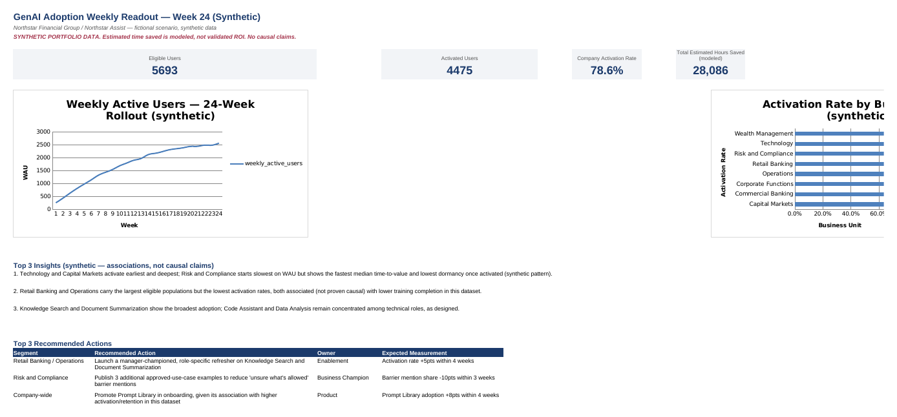
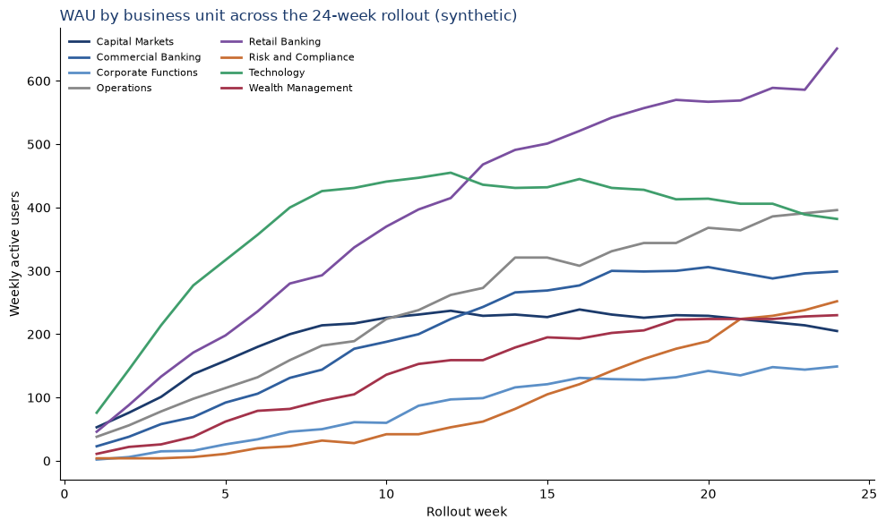
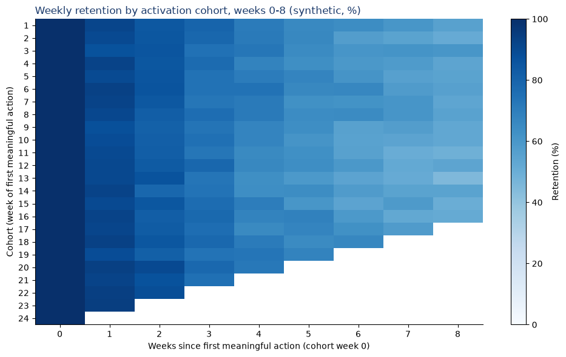

# GenAI Enterprise Adoption Intelligence Hub

An end-to-end analytics portfolio project simulating how an AI Business Enablement team measures a large-scale internal GenAI rollout — synthetic data generation and cleaning in Python, a PostgreSQL star schema and analytical SQL, reproducible metrics and notebooks, a fully specified Power BI model, a working Excel companion workbook, and a Week-24 executive memo.

> **Note:** This repo includes the Power BI data model, DAX measures, report design, and step-by-step build instructions. The `.pbix` file is not included because Power BI Desktop is Windows-only, but the full analytics pipeline and reporting specs are complete.

**⚠️ Synthetic portfolio project.** Every dataset, organization, employee, usage event, feedback comment, and "estimated time saved" figure in this repository is randomly generated and fictional. This project does **not** use, reference, or imply access to RBC, TD, or any real financial institution's data, systems, or employees. No causal or validated-ROI claim is made anywhere in this repo — see `docs/assumptions_and_limitations.md`.

## The business questions

This project answers the questions an AI Business Enablement analyst is actually asked to answer weekly:

1. Are employees adopting the internal GenAI assistant?
2. Which business units, roles, and cohorts are activating or failing to activate?
3. Which features produce repeat usage and estimated value?
4. How quickly do users reach first value?
5. Is training associated with adoption?
6. What user-reported barriers are preventing adoption?
7. What actions should product and enablement teams take next week?

## Business scenario

**Northstar Financial Group** (fictional), 6,000 employees across 8 business units, rolling out **Northstar Assist** (fictional internal GenAI assistant, 8 features) over a 24-week, 6-wave rollout. Technology and technical roles adopt earliest and most deeply; Risk and Compliance starts cautious and improves after training/approved-use-case communications; Retail Banking and Operations carry the largest headcount but the most uneven training attendance. See `docs/assumptions_and_limitations.md` for exactly which patterns were deliberately designed into the data generator.

## Architecture / data flow


## Dataset scale (synthetic, validated)

| File                                          |                                                         Rows | Notes                          |
| --------------------------------------------- | -----------------------------------------------------------: | ------------------------------ |
| `users.csv` → `clean_users.csv`               | 6,008 raw (6,000 unique + 8 intentional dupes) → 6,000 clean |                                |
| `usage_events.csv` → `clean_usage_events.csv` |                                  238,617 raw → 236,960 clean | Target range 120,000–250,000 ✓ |
| `feedback.csv` → `clean_feedback.csv`         |                                      7,684 raw → 7,677 clean | Target range 5,000–12,000 ✓    |
| `training_sessions.csv`                       |                                                           61 |                                |
| `feature_catalog.csv`                         |                                                            8 |                                |
| `calendar.csv`                                |                                                          168 | 24 weeks × 7 days              |

Raw files intentionally contain duplicates, missing values, inconsistent labels, and invalid records — `src/transform_data.py` finds and documents 19 distinct issue categories in `data/processed/data_quality_issues.csv` (nothing is silently dropped or invented). A real generator bug was even caught by validating the SQL load against live PostgreSQL — see `sql/README_VALIDATION.md`.

## Technology stack

Python (pandas, numpy) · PostgreSQL / SQL · Power BI / DAX / Power Query · Excel (openpyxl-generated, LibreOffice-recalculated) · Jupyter · Git/GitHub

## Repository structure

```text
genai-enterprise-adoption-intelligence-hub/
  data/
    raw/                    Generated raw CSVs (intentional quality issues)
    processed/              Cleaned CSVs + data_quality_issues.csv/.md
    synthetic_data_dictionary.md
  src/
    generate_synthetic_data.py   Deterministic synthetic data generator (seed=42)
    transform_data.py            Cleaning pipeline
    analysis.py                  Reusable metric functions
    build_excel_workbook.py      Builds the Excel companion workbook
  sql/
    01_create_schema.sql         Star schema DDL + \copy load
    02_adoption_metrics.sql      9 analytical queries
    03_weekly_insights.sql       Weekly executive KPI/segment query
    README_VALIDATION.md         Real PostgreSQL run log
  notebooks/
    01_data_quality_and_eda.ipynb    Executed end-to-end, outputs saved
    02_adoption_analysis.ipynb       Executed end-to-end, outputs saved
  powerbi/
    dax_measures.md          Model + every requested DAX measure
    report_design.md         All 3 report pages, visual-by-visual
    BUILD_INSTRUCTIONS.md    Manual Power BI Desktop build guide (no fabricated .pbix)
  excel/
    GenAI_Weekly_Adoption_Readout.xlsx   Generated + LibreOffice-recalculated, 0 formula errors
    excel_build_guide.md                 What's live vs. manual, and exact steps for both
  docs/
    metric_dictionary.md, data_model.md, assumptions_and_limitations.md
    executive_weekly_readout.md   Week-24 memo
    qualitative_research_plan.md
    project_screenshots/
  tests/                     51 automated tests (pytest)
```

## Reproducible setup

```bash
git clone <this-repo-url>
cd genai-enterprise-adoption-intelligence-hub
python3 -m venv .venv && source .venv/bin/activate
pip install -r requirements.txt

# 1. Generate synthetic raw data (deterministic — identical output every run)
python src/generate_synthetic_data.py

# 2. Clean it (documents every issue found/fixed)
python src/transform_data.py

# 3. Run the automated test suite
pytest -v

# 4. (Optional) Build the PostgreSQL star schema and run the SQL queries
createdb genai_adoption
psql -d genai_adoption -f sql/01_create_schema.sql
psql -d genai_adoption -f sql/02_adoption_metrics.sql
psql -d genai_adoption -f sql/03_weekly_insights.sql

# 5. (Optional) Re-run the notebooks
jupyter nbconvert --to notebook --execute --inplace notebooks/01_data_quality_and_eda.ipynb
jupyter nbconvert --to notebook --execute --inplace notebooks/02_adoption_analysis.ipynb

# 6. (Optional) Rebuild the Excel workbook
python src/build_excel_workbook.py
```

Power BI is the one piece that is intentionally **not** scripted — see `powerbi/BUILD_INSTRUCTIONS.md` for why, and the exact steps to build `GenAI_Adoption_Intelligence.pbix` yourself in ~30–45 minutes.

## Metric summary

Full definitions (numerator, denominator, timeframe, purpose, caveat, worked example) are in `docs/metric_dictionary.md`. Headline metrics: Eligible Users, Activation Rate, Weekly/Monthly Active Users, Stickiness, Feature Adoption Rate, Time-to-Value, Retention (weekly cohorts), Dormancy, Training Completion Rate, Estimated Time Saved (**modeled, not validated ROI**), Recommendation Rate.

## Key simulated findings

*(All figures are synthetic — see `docs/executive_weekly_readout.md` for the full memo with sourcing.)*

* **Activation rate: 78.6%** (4,475 of 5,693 eligible users), but Retail Banking combines the largest eligible population (1,652) with the lowest activation rate (71.9%) and lowest training completion (52.2%).
* **Training completion is associated with a ~19-point higher activation rate** (85.0% vs. 65.9%) — reported as an association, not proof of causation, since training completion isn't randomly assigned in this data.
* **Risk and Compliance shows the fastest median time-to-value (13.2 hrs) and lowest dormancy (12.3%)** once activated, despite the slowest initial WAU ramp — consistent with a "cautious start, strong follow-through" story.
* **Prompt Library adoption lags in exactly the highest-volume units** (36–38% in Operations/Retail Banking vs. 61.6% in Technology), despite being associated with higher activation/retention across the dataset.
* **Modeled estimated time saved: ~28,086 hours** across the rollout — a directional signal only, never validated ROI.

## Key recommendations

See `docs/executive_weekly_readout.md` for the full table with owners and success measures. In brief: a manager-championed refresher on core features and Prompt Library for Retail Banking/Operations (Enablement); additional approved-use-case examples for Risk and Compliance (Business Champion); and a Prompt Library walkthrough added to standard onboarding (Product).

## Screenshots

*(Power BI report screenshots will be added here once the `.pbix` is built manually per `powerbi/BUILD_INSTRUCTIONS.md` — that step is intentionally left for hands-on completion, not automated. The two below are real, generated outputs already in this repo.)*

**Excel `Weekly_Readout` sheet** (native Excel charts, live KPI cells — see `excel/GenAI_Weekly_Adoption_Readout.xlsx`):



**Notebook: WAU by business unit, 24-week rollout** (from `notebooks/02_adoption_analysis.ipynb`):



**Notebook: weekly retention by activation cohort** (from `notebooks/02_adoption_analysis.ipynb`):



## Limitations

* All data is synthetic and fictional; nothing represents a real company.
* "Estimated time/hours saved" is a modeled assumption baked into the data generator, never a measured or validated ROI figure.
* Every reported "association" (training ↔ activation, Prompt Library ↔ retention) reflects a pattern deliberately designed into the generator to make the dataset analyzable — not a validated real-world finding, and no causal claim is made.
* `fact_training_attendance` is grained at the scheduled-session level (aggregate counts), not per individual attendee.
* The Excel workbook's `Pivot_*` sheets are pivot-style static summary tables, not native Excel PivotTable objects, and the workbook has no live Power Query connection — both are fully achievable manually in a few minutes; see `excel/excel_build_guide.md`.
* The Power BI `.pbix` was intentionally not generated by this project — see `powerbi/BUILD_INSTRUCTIONS.md`.

Full list: `docs/assumptions_and_limitations.md`.

## What I learned

Building this project end-to-end surfaced lessons that don't show up when you only look at a finished dashboard:

* **A synthetic dataset needs its own QA.** Deliberately injecting messy data (duplicates, invalid timestamps, negative values) and then building a pipeline to detect and document — not silently fix — every one of them was a good forcing function for thinking like a data quality owner, not just an analyst consuming clean data.
* **Validating against a real database catches real bugs.** Actually standing up PostgreSQL and loading the star schema (rather than just eyeballing SQL syntax) surfaced a genuine generator bug — a handful of events dated past the rollout window — that a syntax check alone would have missed. See `sql/README_VALIDATION.md`.
* **"Formula-driven" and "verified" are different claims.** Building the Excel workbook meant learning that `openpyxl` writes formulas without cached values, and that not every modern Excel function (XLOOKUP, LET) can be reliably checked by an automated recalculation pass — which shaped a concrete, documented decision (INDEX/MATCH instead of XLOOKUP) rather than shipping something unverifiable.
* **Metric definitions need caveats attached at the point of use, not just in a glossary.** Writing "stickiness is a proxy for depth, not value" or "association, not causation" next to every chart that needed it (not just once in a docs page) made the whole project's claims more honest and, frankly, more defensible in a real interview.
* **Knowing what to automate vs. leave manual is itself a skill.** Deciding not to fabricate a `.pbix` or claim native PivotTables that `openpyxl` can't actually produce — and instead writing exact manual build guides — felt like the more professionally honest choice than a polished-looking shortcut.

## Development note

This project was scoped, reviewed, tested, and finalized by Jaideep Singh. AI-assisted tools were used in parts of the workflow to speed up implementation and documentation, but all outputs were reviewed and validated before inclusion in the final project.

## Interview talking points

* Walk through the data-quality pipeline: what was injected on purpose, what the cleaning script found, and the explicit decisions made about null-vs-remove-vs-flag for each category (`data/processed/data_quality_issues.csv`).
* Explain the Activated User definition and why its 3-actions/14-days threshold is a designed choice, not an industry standard — and what you'd test to validate or refine it with real data.
* Discuss the real bug caught by PostgreSQL validation (`sql/README_VALIDATION.md`) as an example of "test against the real system, not just the code."
* Explain the Excel XLOOKUP/LET substitution decision as an example of choosing verifiability over checking a box.
* Talk through how you'd extend the qualitative research plan (`docs/qualitative_research_plan.md`) into an actual mixed-methods program if this were a real rollout.

### 30-second pitch

"I built an analytics project simulating how an enterprise AI Business Enablement team would measure a GenAI rollout — a synthetic dataset of 6,000 employees and 24 weeks of usage data, a documented cleaning pipeline, a PostgreSQL star schema I validated against a real database, a fully specified Power BI reporting layer, and a generated, formula-checked Excel workbook. Every number is synthetic and clearly labeled — the point was to demonstrate the full analytics-to-recommendation pipeline, including the parts most portfolio projects skip, like documenting data quality decisions and catching a real bug through validation."

### 90-second pitch

"This project simulates the core workflow of an AI Business Enablement analyst: measuring adoption of an internal GenAI tool across a fictional 6,000-person company over a 24-week rollout. I started by writing a deterministic Python generator that produces realistic — and deliberately messy — synthetic data: duplicate records, missing values, inconsistent labels, a few invalid rows. Then I built a cleaning pipeline that finds and documents every one of those issues rather than silently fixing them, which mattered to me because in a real job you need to be able to explain what you changed and why.

From there I built a PostgreSQL star schema and nine analytical SQL queries covering activation, retention, time-to-value, and feature adoption, and actually ran them against a live database rather than just writing syntax — that step caught a real bug in my data generator. I mirrored the same metrics in Python for notebook-based analysis, then designed a full Power BI model with DAX measures and a three-page report specification, and generated an Excel companion workbook with live formulas, conditional formatting, and native charts, which I verified with an automated recalculation check before committing it.

The whole thing wraps up in a Week-24 executive memo with five KPIs, three findings, and three recommended actions — all explicitly labeled synthetic, with every 'association' called out as not causal. I think the most interesting part is less the dashboards themselves and more the discipline around what I could verify versus what I was honest about not being able to package, like the Power BI `.pbix` file, which I documented as a manual build rather than faking."

## 5 tough interview questions and honest answers

**Q1: This is all fake data — how do I know you can do this with real, messy enterprise data?**

A: The synthetic data isn't clean by design — it has duplicates, missing values, inconsistent labels, and invalid records injected on purpose, and the cleaning pipeline (`src/transform_data.py`) handles all of them the same way I'd handle real messiness: detect, document, decide (null vs. remove vs. flag), never silently fix. The skills demonstrated — SQL, pandas, star schema design, DAX, Excel formulas — transfer directly; what wouldn't transfer without adjustment is the specific business judgment calls (like threshold choices) that would need real stakeholder input in a live rollout.

**Q2: Your "activation" definition (3 actions in 14 days) seems arbitrary — how would you defend it?**

A: It is a designed choice, and I say so explicitly in `docs/metric_dictionary.md` rather than presenting it as an industry standard. In a real job, I'd validate a threshold like this against actual downstream outcomes (e.g., does 3-in-14 actually predict 90-day retention better than 2-in-7 or 5-in-30?) before treating it as final — that's exactly the kind of iteration I'd expect in the first few weeks of a real rollout.

**Q3: You claim "estimated hours saved" but call it "not validated ROI" — isn't that just an excuse to avoid rigor?**

A: The opposite — it's the rigorous position. A real, defensible ROI number requires either a randomized/controlled comparison or a validated time-and-motion study; a per-action assumed range sampled by a data generator is neither, and I'd rather say that plainly than let a big-looking number imply more certainty than it has. If I were doing this for real, my first ask would be for a small controlled time-tracking study to replace the assumption.

**Q4: Why didn't you just fake the Power BI `.pbix` file or a screenshot of it?**

A: Because I can't verify a `.pbix` I didn't build in Power BI Desktop actually opens, has correct relationships, or renders the visuals I specified — and shipping something unverifiable and calling it done would undermine the credibility of everything else in the project. I documented the exact model and every DAX measure instead, and a step-by-step guide, so the actual build is fast and the result is something I can stand behind.

**Q5: What would you do differently if you rebuilt this?**

A: Two things: I'd design the activation/retention definitions and the SQL schema at the same time instead of sequentially, since a couple of small mismatches (e.g., retention's cohort definition vs. the formal activation definition) only became obvious once both existed; and I'd build a small synthetic "ground truth" — a few hand-constructed users with known expected metric values — earlier, specifically to catch the two real bugs I found during Phase 3/4 validation (a rollout-window date bug and a broken `groupby` argument) sooner and more systematically than ad hoc smoke tests.
