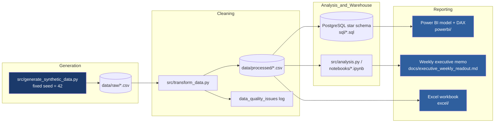

# GenAI Enterprise Adoption Intelligence Hub

> **Status: Phase 1 of 8 complete** (synthetic data generation). SQL, Power BI,
> Excel, and the executive memo are not yet built — see the Implementation
> Plan section below for what's coming.

**⚠️ Synthetic portfolio project.** Every dataset, organization, employee,
usage event, feedback comment, and "estimated time saved" figure in this
repository is randomly generated, fictional, and produced for demonstration
purposes only. This project does **not** use, reference, or imply access to
RBC, TD, or any real financial institution's data, systems, or employees. No
causal or validated-ROI claims are made anywhere in this repo — see
`docs/assumptions_and_limitations.md`.

## Project summary

This project simulates an internal analytics function for a fictional
enterprise ("Northstar Financial Group") rolling out an internal GenAI
assistant ("Northstar Assist") to 6,000 employees, and builds the Python, SQL,
Power BI, and Excel deliverables an AI Business Enablement analyst would use
to measure and report on that rollout.

## The business question

Enterprise leadership wants weekly answers to:

1. Are employees adopting the internal GenAI assistant?
2. Which business units, roles, and cohorts are activating or failing to activate?
3. Which features produce repeat usage and estimated value?
4. How quickly do users reach first value?
5. Is training associated with adoption?
6. What user-reported barriers are preventing adoption?
7. What actions should product and enablement teams take next week?

## Business scenario

- **Organization:** Northstar Financial Group (fictional), 6,000 employees
  across 8 business units: Retail Banking, Commercial Banking, Capital
  Markets, Wealth Management, Operations, Technology, Risk and Compliance,
  Corporate Functions.
- **Product:** Northstar Assist, an internal GenAI assistant with 8 features:
  Chat and Research, Document Summarization, Drafting Assistant, Meeting
  Notes, Data Analysis, Code Assistant, Knowledge Search, Prompt Library.
- **Rollout:** 24 weeks, 6 waves of ~4 weeks each. Technology and technical
  roles (Developer, Analyst) adopt earlier and more deeply. Risk and
  Compliance starts cautious and improves after training/approved-use-case
  communications. Retail Banking and Operations have high headcount but mixed
  activation due to time constraints and uneven training attendance.

## Architecture / data flow



## Dataset scale (synthetic)

| File | Rows (current build) | Notes |
|---|---|---|
| `users.csv` | 6,008 (6,000 unique + 8 intentional duplicates) | |
| `usage_events.csv` | 238,617 | Target range 120,000–250,000 |
| `feedback.csv` | 7,684 | Target range 5,000–12,000 |
| `training_sessions.csv` | 61 | |
| `feature_catalog.csv` | 8 | |
| `calendar.csv` | 168 | 24 weeks × 7 days |

Raw files intentionally include duplicates, missing values, inconsistent
labels, and a small number of invalid records so the data-quality pipeline has
real problems to solve. See `data/synthetic_data_dictionary.md` for full
column-level documentation and a list of every injected issue.

## Technology stack

Python (pandas, numpy) · SQL / PostgreSQL · Power BI / DAX · Power Query ·
Excel · Git/GitHub · Jupyter

## Folder structure

```
genai-enterprise-adoption-intelligence-hub/
  README.md                        This file.
  requirements.txt                 Python dependencies.
  .gitignore
  LICENSE                          MIT license for this portfolio project.
  data/
    raw/                           Generated raw CSVs (intentional quality issues).
    processed/                     Cleaned CSVs (Phase 2, not yet built).
    synthetic_data_dictionary.md   Full column-level data dictionary for raw files.
  notebooks/
    01_data_quality_and_eda.ipynb  (Phase 4, not yet built)
    02_adoption_analysis.ipynb     (Phase 4, not yet built)
  src/
    generate_synthetic_data.py     Deterministic synthetic data generator (this phase).
    transform_data.py              Cleaning pipeline (Phase 2, not yet built).
    analysis.py                    Metrics/analysis functions (Phase 4, not yet built).
  sql/
    01_create_schema.sql           Star schema DDL (Phase 3, not yet built).
    02_adoption_metrics.sql        Adoption/activation queries (Phase 3, not yet built).
    03_weekly_insights.sql         Weekly executive insight query (Phase 3, not yet built).
  powerbi/
    GenAI_Adoption_Intelligence.pbix  (Phase 5-6, not yet built)
    dax_measures.md                   (Phase 5, not yet built)
    report_design.md                  (Phase 6, not yet built)
  excel/
    GenAI_Weekly_Adoption_Readout.xlsx  (Phase 7, not yet built)
    excel_build_guide.md                (Phase 7, not yet built)
  docs/
    metric_dictionary.md              Metric definitions (placeholder — Phase 4).
    executive_weekly_readout.md       Week 24 memo (placeholder — Phase 7/10).
    data_model.md                     Star schema documentation (placeholder — Phase 3).
    assumptions_and_limitations.md    Assumptions/limitations (initial version, this phase).
    project_screenshots/              Report screenshots (Phase 8).
  tests/
    test_data_quality.py              Structural tests on raw data (this phase).
```

## Reproducible setup

```bash
git clone <this-repo-url>
cd genai-enterprise-adoption-intelligence-hub
python3 -m venv .venv && source .venv/bin/activate
pip install -r requirements.txt

# Regenerate the synthetic raw data (deterministic — same output every run)
python src/generate_synthetic_data.py

# Run the structural data-quality tests
pytest tests/test_data_quality.py -v
```

## Key simulated findings

*(Placeholder — to be completed after the analysis phase. All findings will be
explicitly labeled as simulated and framed as associations, not causal
claims.)*

## Key recommendations

*(Placeholder — to be completed after the analysis phase.)*

## Project limitations

See `docs/assumptions_and_limitations.md` for the full list. In short: all
data is synthetic; "estimated minutes/hours saved" is a modeled assumption,
not measured or validated ROI; training-activation relationships in this
dataset are associations by construction, not evidence of real-world
causation; feedback text is templated synthetic text, not real employee
statements.

## What I learned

*(Placeholder — to be completed at the end of the build.)*

## Interview talking points

*(Placeholder — to be completed at the end of the build.)*
