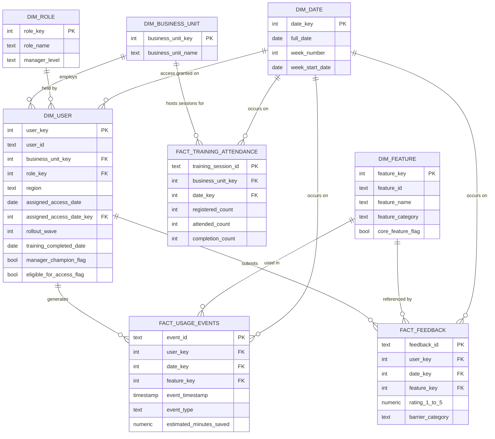

# Data Model

This document describes the star schema built by `sql/01_create_schema.sql`
(PostgreSQL) and re-used, in a slightly flattened form suited to Power BI's
import model, in `powerbi/dax_measures.md` / `powerbi/BUILD_INSTRUCTIONS.md`.
Both are grounded in the same cleaned CSVs in `data/processed/`.

All entities describe the fictional Northstar Financial Group / Northstar
Assist scenario — see `data/synthetic_data_dictionary.md` for the source
column dictionary.

## Entity-relationship diagram

## Grain and keys

| Table | Grain | Primary key | Row count (synthetic) |
|---|---|---|---|
| `dim_user` | One row per unique employee | `user_key` (surrogate); `user_id` (natural, unique) | 6,000 |
| `dim_business_unit` | One row per business unit | `business_unit_key`; `business_unit_name` (natural) | 8 |
| `dim_role` | One row per job role | `role_key`; `role_name` (natural) | 8 |
| `dim_feature` | One row per Northstar Assist feature, plus 1 "Unknown" member (key = -1) | `feature_key`; `feature_id`/`feature_name` (natural) | 9 (8 + Unknown) |
| `dim_date` | One row per calendar day in the 24-week rollout | `date_key` (int, `YYYYMMDD`); `full_date` (natural) | 168 |
| `fact_usage_events` | One row per usage event | `event_id` | 236,960 |
| `fact_feedback` | One row per feedback submission | `feedback_id` | 7,677 |
| `fact_training_attendance` | One row per **scheduled training session** (aggregate counts) — **not** one row per individual attendee | `training_session_id` | 61 |

**Important grain note on `fact_training_attendance`:** the source data
(`training_sessions.csv`) is an aggregate session log (`registered_count` /
`attended_count` / `completion_count` per session), not a per-user attendance
roster. This fact table's grain is therefore "one scheduled session," and it
cannot be joined to `dim_user` directly. Individual-level training status
lives on `dim_user` instead (`training_assigned_date` /
`training_completed_date`). See `docs/assumptions_and_limitations.md`.

## Relationships (PostgreSQL model)

| From (many side) | To (one side) | Cardinality | Notes |
|---|---|---|---|
| `dim_user.business_unit_key` | `dim_business_unit.business_unit_key` | many-to-one | |
| `dim_user.role_key` | `dim_role.role_key` | many-to-one | |
| `dim_user.assigned_access_date_key` | `dim_date.date_key` | many-to-one | Nullable — some users have no access date on file |
| `fact_usage_events.user_key` | `dim_user.user_key` | many-to-one | |
| `fact_usage_events.date_key` | `dim_date.date_key` | many-to-one | |
| `fact_usage_events.feature_key` | `dim_feature.feature_key` | many-to-one | Defaults to -1 ("Unknown") when `feature_name` is null, so no fact row is ever an orphan join |
| `fact_feedback.user_key` | `dim_user.user_key` | many-to-one | |
| `fact_feedback.date_key` | `dim_date.date_key` | many-to-one | |
| `fact_feedback.feature_key` | `dim_feature.feature_key` | many-to-one | Same -1 "Unknown" convention |
| `fact_training_attendance.business_unit_key` | `dim_business_unit.business_unit_key` | many-to-one | |
| `fact_training_attendance.date_key` | `dim_date.date_key` | many-to-one | |

This is a textbook star schema: every fact table's foreign keys point only at
dimension tables, dimensions do not reference facts, and there is no
many-to-many relationship anywhere in the model.

## How this maps to the Power BI model

Power BI's import model (built manually in Power BI Desktop per
`powerbi/BUILD_INSTRUCTIONS.md`) uses the same shape but natural keys instead
of surrogate integer keys, since Power Query/DAX work naturally with text
keys and there's no ETL-performance reason to introduce surrogates at this
scale:

- `Users` (from `clean_users.csv`) — relates to `Business_Unit`, `Role`, and `Calendar` (via `assigned_access_date`)
- `Business_Unit`, `Role` — small reference dimensions (built via Power Query, unique values from `Users`)
- `Feature_Catalog` (from `clean_feature_catalog.csv`) — includes an added "Unknown / Not Captured" row, mirroring `dim_feature`'s -1 member
- `Calendar` (from `clean_calendar.csv`) — marked as the model's official Date table
- `Usage_Events`, `Feedback` (fact tables) — relate to `Users`, `Feature_Catalog`, and `Calendar`
- `Training_Sessions` (fact table, session-level grain) — relates to `Business_Unit` and `Calendar`

Exact relationship cardinalities, active/inactive status, and filter
directions for the Power BI model are specified in
`powerbi/dax_measures.md` (top section) and `powerbi/BUILD_INSTRUCTIONS.md`.

## Design decisions worth calling out

- **A synthetic "Unknown" dimension member (key = -1)** is used in both the
  SQL and Power BI models for `feature_key`/`Feature_Catalog` so that a fact
  row with a missing `feature_name` (a documented, retained data-quality
  issue — see `data/processed/data_quality_issues.csv`) never produces a
  broken join or an implicit blank row that behaves inconsistently across
  visuals.
- **Surrogate integer keys** are used in PostgreSQL (`SERIAL`) for
  conventional data-warehouse hygiene and join performance at scale, even
  though this dataset is small enough that natural-key joins would also
  perform fine.
- **`dim_date` is populated from `calendar.csv`**, not generated inline by
  SQL, so the exact rollout window (168 days) stays the single source of
  truth used by the generator, the cleaning pipeline, and both downstream
  data models.
